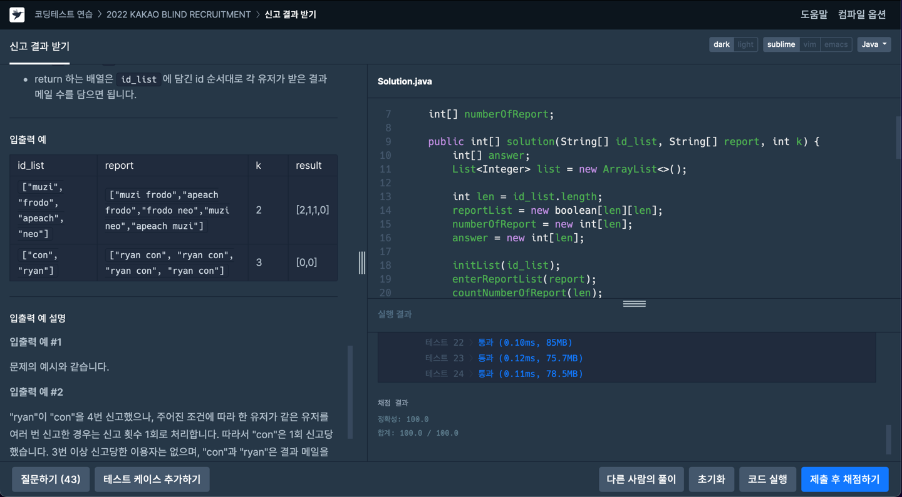

# [2022 KAKAO BLIND RECRUITMENT - 1] 신고 결과 받기

## ✍🏻 [풀이](https://seongho96.tistory.com/24)
카카오 코테에서 자주 출제되는 문자열 처리 후 구현하는 문제이다.

우선 `id`를 매핑하기 위해 `map`이 필요하다.
그리고 `유저 ID`와 `유저가 신고한 ID`를 저장하는 자료구조를 map과 Boolean 2차원 배열을 고민하다가 Boolean 2차원 배열로 하기로 했다.

한 유저가 동일한 유저에 대한 신고 횟수는 1회이기 때문에 `boolean[][]`로 선언을 하고 `report`를 공백 분리한 후 `유저 ID`와 `유저가 신고한 ID` 테이블에 저장한다.

유저가 신고받은 횟수를 구하고 `k`번 이상 신고를 받은 유저 리스트를 따로 만들어 저장한다.

그리고 문제 설명대로 `answer` 값을 구하고 반환하면 된다.